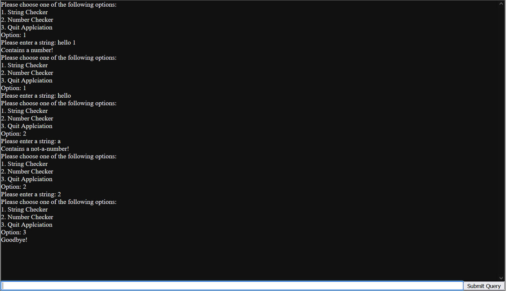

# EXSM 3935: JavaScript Fundamentals - JavaScript Loops Exercise 01
**Deadline for Feedback:** Wednesday, Aug 16, 2023 at 11:59 PM  
[Exercise Link](https://classroom.github.com/a/mn12Ddao)

## Introduction
In this exercise you will use what you’ve learned regarding comparisons, decisions, loops and functions to create a console based persistent menu which checks over data entered before the entry is accepted.

The menu should be persistent (the choices are repeated until a valid choice is made and after a checker is run, and the program should only terminate when the user specifically selects quit option) and offer the following choices:
- String Checker
- Integer Checker
- Year Checker
- Date Checker
- Quit Application

Each checker should be encapsulated in a function returning true or false (whether the value is valid).

- **String Checker:** When this choice is selected, the user should be prompted to enter a string. If the string contains any integers, the program should print “Contains a number!”.
- **Integer Checker:** When this choice is selected, the user should be prompted to enter a string. If the string contains any non-numeric values, the program should print “Not a number!”.
- **Year Checker:** When this choice is selected, the user should be prompted to enter a string. If the string is not a number between 1900 and the current year, the program should print “Not a year!”.
- **Date Checker:** When this choice is selected, the user should be prompted to enter a date in the format YYYY-MM-DD. If the string does not meet this format (month not more than 12 and day not more than 31, month-specific day counts optional), the program should print “Not a date!”.
- **Quit Application:** The program should print “Goodbye!” and then terminate.

Here is a sample of a program implementing the first two options:

